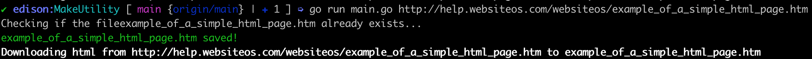

# 🔗 makeutility

[](https://goreportcard.com/report/github.com/edison4354/makeutility)

This is a utility script that downloads the HTML from any give url link and copies it into a new file for ease of readibilty when trying to see the markup for a website.

### Usage

```bash
$ go run main.go <url>
```

### Example

```bash
$ go run main.go http://help.websiteos.com/websiteos/example_of_a_simple_html_page.htm
Checking if the fileexample_of_a_simple_html_page.htm already exists...
example_of_a_simple_html_page.htm saved!
Downloading html from http://help.websiteos.com/websiteos/example_of_a_simple_html_page.htm to example_of_a_simple_html_page.htm
```


